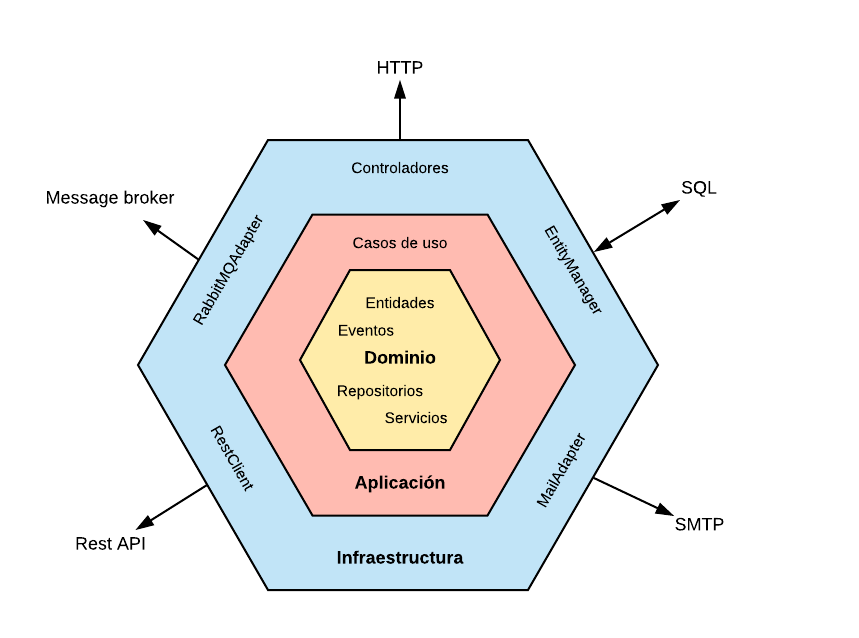

# Arquitectura Hexagonal (Puertos y Adaptadores)

La arquitectura hexagonal, también conocida como "arquitectura de puertos y adaptadores," es un enfoque de diseño de software que promueve la separación de las preocupaciones y facilita la mantenibilidad, escalabilidad y pruebas de aplicaciones. En esta guía, exploraremos los conceptos clave de la arquitectura hexagonal y cómo implementarla en tus proyectos.

## ¿Qué es la Arquitectura Hexagonal?

La arquitectura hexagonal se basa en el principio de que una aplicación se puede dividir en tres capas principales: la capa de dominio, la capa de aplicación y la capa de infraestructura.

- **Capa de Dominio:** Contiene la lógica central de la aplicación, incluyendo reglas de negocio, entidades y valor de objetos. Esta capa es independiente de la capa de infraestructura y las tecnologías utilizadas.

- **Capa de Aplicación:** Actúa como un intermediario entre la capa de dominio y la capa de infraestructura. Aquí se definen los casos de uso y se orquesta la interacción entre los diferentes componentes.

- **Capa de Infraestructura:** Maneja los detalles técnicos y la interacción con recursos externos, como bases de datos, servicios web, y sistemas externos.

## Principales Características

La arquitectura hexagonal presenta las siguientes características clave:

- **Desacoplamiento:** Las capas están altamente desacopladas, lo que facilita cambios en una capa sin afectar a las demás. Esto mejora la mantenibilidad y la flexibilidad del sistema.

- **Pruebas Unitarias:** Al separar claramente las capas, es más fácil realizar pruebas unitarias y pruebas de integración. Esto garantiza la calidad del software.

- **Reutilización:** La lógica de negocio central se encuentra en la capa de dominio, lo que permite reutilizarla en diferentes interfaces de usuario o canales de comunicación.

## Implementación

Para implementar la arquitectura hexagonal en tu proyecto, sigue estos pasos:

1. Define la capa de dominio con tus entidades, objetos de valor y reglas de negocio.

2. Crea la capa de aplicación para definir los casos de uso y las interacciones entre la capa de dominio y la capa de infraestructura.

3. En la capa de infraestructura, implementa los adaptadores para la interacción con bases de datos, servicios externos y otros recursos.

4. Usa inyección de dependencias para conectar las capas y asegurarte de que la capa de aplicación pueda acceder a los servicios de infraestructura necesarios.

## Ejemplo de Estructura de Directorios

```plaintext
|-- my-app/
    |-- src/
        |-- main/
            |-- java/
                |-- application/       # Capa de Aplicación
                |-- domain/            # Capa de Dominio
                |-- infrastructure/    # Capa de Infraestructura


